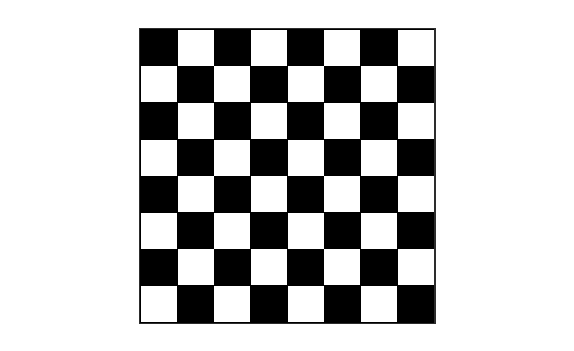
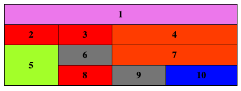
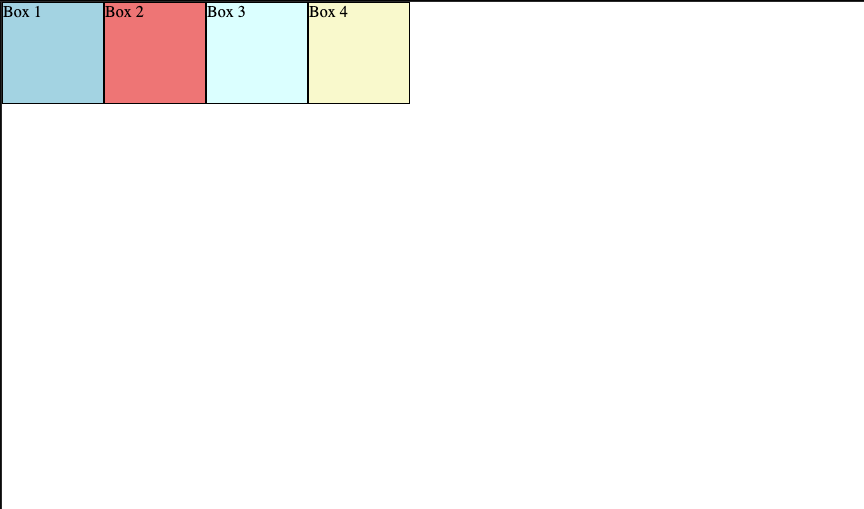
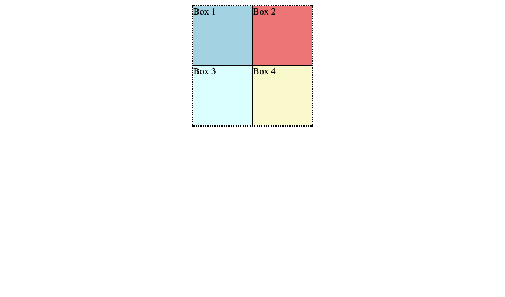

# Projeto Vem Ser Tech - Ada/iFood - Aula 5 - Trabalhando com Seletores CSS

## Bora praticar!

### Desafio 1 - `odd` e `even`

**HTML**

```HTML
<div class="chessboard">
  <table>
    <tbody>
      <tr>
        <td></td>
        <td></td>
        <td></td>
        <td></td>
        <td></td>
        <td></td>
        <td></td>
        <td></td>
      </tr>
      <tr>
        <td></td>
        <td></td>
        <td></td>
        <td></td>
        <td></td>
        <td></td>
        <td></td>
        <td></td>
      </tr>
      <tr>
        <td></td>
        <td></td>
        <td></td>
        <td></td>
        <td></td>
        <td></td>
        <td></td>
        <td></td>
      </tr>
      <tr>
        <td></td>
        <td></td>
        <td></td>
        <td></td>
        <td></td>
        <td></td>
        <td></td>
        <td></td>
      </tr>
      <tr>
        <td></td>
        <td></td>
        <td></td>
        <td></td>
        <td></td>
        <td></td>
        <td></td>
        <td></td>
      </tr>
      <tr>
        <td></td>
        <td></td>
        <td></td>
        <td></td>
        <td></td>
        <td></td>
        <td></td>
        <td></td>
      </tr>
      <tr>
        <td></td>
        <td></td>
        <td></td>
        <td></td>
        <td></td>
        <td></td>
        <td></td>
        <td></td>
      </tr>
      <tr>
        <td></td>
        <td></td>
        <td></td>
        <td></td>
        <td></td>
        <td></td>
        <td></td>
        <td></td>
      </tr>
    </tbody>
  </table>
</div>
```

**CSS**

```CSS
body {
    display: flex;
    justify-content: center;
    align-items: center;
    height: 100vh;
    margin: 0;
}

.chessboard {
    border: 2px solid #333;
    display: inline-block;
}

table {
    border-collapse: collapse;
}

td {
    width: 50px;
    height: 50px;
    text-align: center;
    border: 1px solid #000;
}
```

→  Crie um tabuleiro utilizando o código acima, utilize seletores css `nth-child` com valores `odd` e `even` para obter o resultado semelhante da imagem abaixo:



| ------------------------------------------------------------------------------------- |

### Desafio 2 - Seletores CSS

**HTML**

```HTML
<section>
  <table>
    <thead>
      <tr>
        <th colspan="4">
          1
        </th>
      </tr>
      <tr>
        <th>2</th>
        <th>3</th>
        <th colspan="2">4</th>
      </tr>
    </thead>
    <tbody>
      <tr>
        <th rowspan="2">5</th>
        <td>6</td>
        <td colspan="2">7</td>
      </tr>
      <tr>
        <th>8</th>
        <td>9</td>
        <td>10</td>
      </tr>
    </tbody>
  </table>
</section>
```

**CSS**

```CSS
table {
  border-collapse: collapse;
  width: 50%;
  margin: 0 auto;
}

tr, th, td {
  border: 1px solid #000;
  padding: 8px;
  text-align: center;
  font-weight: bold;
}
```

→  Dado o código acima, faça as alterações necessárias no CSS (sem utilizar classe ou id) para obter o resultado esperado como na imagem abaixo:



Cores utilizadas:

- greenyellow (5)
- violet (1)
- orangered (4, 7)
- red (2, 3, 8)
- blue (10)
- gray (6, 9)

| ------------------------------------------------------------------------------------- |

### Desafio 3 - Position `absolute`

**HTML**

```HTML
<body>
  <div class="box1">Box 1</div>
  <div class="box2">Box 2</div>
  <div class="box3">Box 3</div>
  <div class="box4">Box 4</div>
</body>
```

**CSS**

```CSS
.box1 {
  height: 100px;
  width: 100px;
  background: lightblue;
  border: 1px solid black;
  right: 222px;
  position: absolute;
}

.box2 {
  height: 100px;
  width: 100px;
  background: lightcoral;
  border: 1px solid black;
  left: 158px;
  position: absolute;
}

.box3 {
  height: 100px;
  width: 100px;
  background: lightcyan;
  border: 1px solid black;
  right: 300px;
  bottom: 100px;
  position: absolute;
}

.box4 {
  height: 100px;
  width: 100px;
  background: lightgoldenrodyellow;
  border: 1px solid black;
  top: 355px;
  right: 0;
  position: fixed;
}
```

→  Dado o código acima, faça  as alterações necessárias no HTML e CSS para obter o resultado esperado como na imagem abaixo:



| ------------------------------------------------------------------------------------- |

### Desafio 4 - Position `relative` e `absolute`

**HTML**

```HTML
<body>
  <div class="box1">Box 1</div>
  <div class="box2">Box 2</div>
  <div class="box3">Box 3</div>
  <div class="box4">Box 4</div>
  
  <div class="box-border"></div>
</body>
```

**CSS**

```CSS
.box-border {
  height: 204px;
  width: 204px;
  border: 2px dotted #000;
  margin: auto;
}

.box1 {
  height: 100px;
  width: 100px;
  background: lightblue;
  border: 1px solid black;
  right: 222px;
  position: absolute;
}

.box2 {
  height: 100px;
  width: 100px;
  background: lightcoral;
  border: 1px solid black;
  right: 158px;
  top: 256px;
  position: absolute;
}

.box3 {
  height: 100px;
  width: 100px;
  background: lightcyan;
  border: 1px solid black;
  right: 300px;
  bottom: 100px;
  position: absolute;
}

.box4 {
  height: 100px;
  width: 100px;
  background: lightgoldenrodyellow;
  border: 1px solid black;
  top: 355px;
  left: 135px;
  position: fixed;
}
```

→  Dado o código acima, faça  as alterações necessárias no HTML e CSS para obter o resultado esperado como na imagem abaixo:



